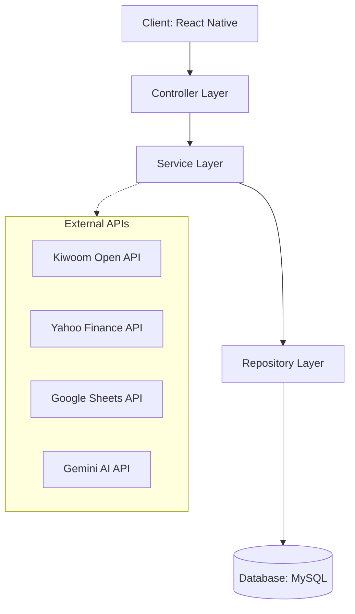

# 📈 stockLog

주식 매매 기록 · 분석 · 전략 관리 · 커뮤니티 기능을 하나로 통합한 **올인원 트레이딩 로그 앱**입니다.

---

# 🧾 프로젝트 소개

**stockLog**는 개인 투자자가 매매 기록을 체계적으로 관리하고,  
손익을 시각적으로 분석하며 투자 전략을 점검하고,  
다른 투자자와 인사이트를 공유할 수 있도록 제작된 서비스입니다.

기존 **노션 · 엑셀 기반 매매일지**의

- 수동 입력
- 데이터 단절

문제를 기술적으로 해결하여  
**자동화된 투자 관리 환경과 AI 기반 인사이트 제공**을 목표로 개발되었습니다.

---

# 🚀 핵심 차별화 기능 (Core Values)

## 1️⃣ 데이터 수집 자동화 (Kiwoom API)

키움증권 Open API를 연동하여  
보유 종목 정보를 자동으로 동기화합니다.

수동 입력 시 발생하는 **데이터 누락 문제를 제거하여 데이터 정확성을 확보**했습니다.

---

## 2️⃣ 데이터 이식성 확보 (CSV Migration)

기존 엑셀 / 노션 사용자들을 위해  
**CSV 기반 데이터 마이그레이션 기능**을 구현했습니다.

과거 매매 데이터를 **손실 없이 일괄 이전**할 수 있어  
사용자의 서비스 전환 비용을 최소화했습니다.

---

## 3️⃣ 지능형 투자 피드백 (Gemini AI)

Gemini AI API를 활용하여  
사용자의 매매 패턴을 분석하고 투자 전략에 대한 피드백을 제공합니다.

단순 기록을 넘어 **투자 의사결정을 돕는 AI 기반 분석 기능**을 구현했습니다.

---

## 4️⃣ 실시간 대시보드 연동 (Google Sheets API)

Google Sheets API를 활용하여  
앱 데이터와 스프레드시트를 실시간 연동했습니다.

사용자는 익숙한 시트 환경에서도

- 수익률
- 포트폴리오 비중

을 확인할 수 있습니다.

---

# 🛠 기술 스택 (Tech Stack)

## Backend

- **Language**: Java 17  
- **Framework**: Spring Boot 3.x  
- **Data Access**: Spring Data JPA (Hibernate)  
- **Build Tool**: Gradle  
- **Database**: MySQL  

## Frontend

- **Framework**: React Native (Expo)
- **Language**: JavaScript / TypeScript
- **Environment**: Expo Go

---

## External Integration

- Kiwoom Open API
- Yahoo Finance API
- Google Sheets API
- Gemini AI API

---

## 🏗 시스템 아키텍처 (System Architecture)

# 📂 프로젝트 구조 (Directory Structure)
src/main/java/com/example/stockLog
├── community       # 커뮤니티 게시판 도메인
├── graph           # 주식 데이터 시각화 도메인
├── portfolio       # 사용자 자산 및 포트폴리오 관리
├── tradelog        # 매매 기록 핵심 도메인
│   ├── controller
│   ├── dto
│   ├── entity
│   ├── repository
│   └── service
├── config          # 전역 설정
└── exception       # Get Exception Handler

# 🛠 트러블슈팅 (Troubleshooting)

## ① CSV 데이터 마이그레이션 시 인코딩 및 파싱 에러

### 문제

노션 / 엑셀에서 내보낸 CSV 파일 로드 시

- 한글 깨짐
- 구분자 파싱 오류

발생

### 해결

- InputStreamReader 캐릭터셋 설정
- 정규식을 활용한 파싱 로직 개선

### 결과

CSV 데이터 마이그레이션 성공률 **100% 확보**

---

## ② 외부 API 응답 지연 및 데이터 매핑 문제

### 문제

외부 금융 API 응답 구조와  
내부 엔티티 구조가 일치하지 않아 데이터 매핑 오류 발생

### 해결

- DTO(Data Transfer Object) 적용
- 외부 API 스펙과 내부 구조 분리

### 결과

시스템 결합도 감소 및 안정성 향상

---

## ③ JPA 순환 참조 문제

### 문제

양방향 연관관계 설정 시  
JSON 직렬화 과정에서 **Infinite Recursion 발생**

### 해결

- `@JsonIgnore`
- Response DTO 분리

### 결과

객체 직렬화 안정성 확보

---

# 📸 주요 기능

## 📝 매매일지 및 캘린더

- 캘린더 기반 매매 기록 관리
- 거래 종류별 색상 시각화
- 매수 금액 자동 계산 로직

---

## 📊 결산 및 전략 관리

- 월별 / 연도별 손익 통계
- 포트폴리오 비중 분석
- Google Sheets 실시간 대시보드

---
# 🤔 Technical Decisions

## 1️⃣ Spring Boot 기반 백엔드 구조 선택

백엔드 개발 프레임워크로 Spring Boot를 선택했습니다.

Spring Boot는 **DI(Dependency Injection), AOP, Transaction 관리** 등  
엔터프라이즈 환경에서 필요한 기능을 안정적으로 제공하며,  
Spring Data JPA와의 높은 호환성을 통해 **빠른 개발과 유지보수성**을 확보할 수 있습니다.

또한 Controller → Service → Repository 구조의  
**Layered Architecture**를 적용하여 비즈니스 로직과 데이터 접근 계층을 분리하고  
시스템 확장성과 테스트 용이성을 고려한 구조로 설계했습니다.

---

## 2️⃣ JPA + DTO 구조를 통한 계층 분리

외부 API 응답 구조와 내부 도메인 모델을 분리하기 위해  
**DTO(Data Transfer Object) 패턴**을 적용했습니다.

외부 API 데이터를 바로 Entity에 매핑할 경우  
서비스 구조가 외부 API 스펙에 종속되는 문제가 발생할 수 있습니다.

따라서

API Response → DTO → Entity

구조로 변환 계층을 두어 **시스템 결합도를 낮추고 유지보수성을 향상**시켰습니다.

---

## 3️⃣ Google Sheets API를 활용한 데이터 관리 전략

투자 데이터 분석을 위해 별도의 관리자 페이지를 구축하는 대신  
Google Sheets API를 활용해 데이터 관리 시스템을 구현했습니다.

Google Sheets를 활용하면

- 데이터 수정이 직관적
- 실시간 데이터 확인 가능
- 별도 관리 UI 개발 필요 없음

이라는 장점이 있어 **빠른 데이터 관리와 서비스 확장성을 동시에 확보**할 수 있었습니다.

---

## 4️⃣ CSV 기반 데이터 마이그레이션 기능 설계

기존 투자자들은 대부분

- 엑셀
- 노션
- 구글 스프레드시트

기반으로 매매 기록을 관리하고 있습니다.

따라서 신규 서비스 사용 시  
기존 데이터를 다시 입력해야 하는 문제를 해결하기 위해  
**CSV 기반 데이터 마이그레이션 기능**을 구현했습니다.

이를 통해 기존 사용자의 **서비스 전환 비용을 최소화**하고  
데이터 연속성을 유지할 수 있도록 설계했습니다.

---

## 5️⃣ 외부 API 의존성 분리를 통한 시스템 안정성 확보

금융 데이터 API는 네트워크 상황이나 외부 서비스 상태에 따라  
응답 지연이나 장애가 발생할 수 있습니다.

이를 고려하여

- API 응답을 DTO로 분리
- 예외 처리 로직 강화
- 서비스 계층에서 데이터 검증 수행

구조를 적용하여 **외부 서비스 장애가 전체 시스템에 영향을 최소화하도록 설계했습니다.**

# 🏁 실행 방법 (How to Run)

## Backend

API Key를 `application.yml`에 설정합니다.
./gradlew bootRun
---

## Frontend
cd frontend
npm install
npx expo start
Expo Go 앱으로 QR 코드를 스캔하여 실행할 수 있습니다.

